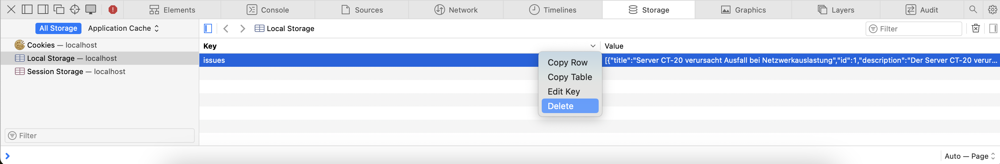

# Next.js Projekt - "What's that error?"
Dies ist das Proof of Concept (PoC) des IP6 Projektes: **"What's that error?" -- Let's make the error messages actionable**. Ziel dieses Projektes ist es, Fehlermeldungen im Systemmonitoring benutzerfreundlicher und verständlicher zu gestalten, indem KI-basierte Lösungen implementiert werden, die die Umsetzbarkeit der Meldungen verbessern.

## Erste Schritte
So starten Sie das Projekt:
1. **Navigieren Sie in das Projektverzeichnis:**
   Öffnen Sie ein Terminal und wechseln Sie in das Verzeichnis der App:
   ```bash
   cd path/to/whats-that-error-app
   ```

2. **Installieren Sie die Abhängigkeiten:**
    ```bash
    npm install
    ```
3. **Starten Sie den Entwicklungsserver:**
    ```bash
    npm run dev
    ```

Der Server läuft standardmässig unter [http://localhost:3000](http://localhost:3000). Der Einstiegspunkt der App ist [http://localhost:3000/Issues](http://localhost:3000/Issues).

### Hinweis zu `npm`
Dieses Projekt verwendet `npm` für die Installation und Verwaltung von Abhängigkeiten. Stellen Sie sicher, dass `npm` auf Ihrem System installiert ist.

Falls `npm` nicht auf Ihrem System installiert ist, können Sie es [hier herunterladen](https://docs.npmjs.com/downloading-and-installing-node-js-and-npm) und installieren.

#### Anleitung für Mac-Benutzer
Kurze Anleitung für Mac User:

Für Mac-Benutzer kann es erforderlich sein, die Command Line Tools zu installieren, bevor npm verwendet werden kann. So geht's: 

Öffnen Sie ein Terminal und geben Sie den folgenden Befehl ein:

```
xcode-select --install
```

Um `nvm` (Node Version Manager) zu installieren, verwenden Sie den folgenden Befehl:
```
curl -o- https://raw.githubusercontent.com/nvm-sh/nvm/v0.40.0/install.sh | bash
```

Nach der Installation von `nvm` (möglicherweise müssen Sie Ihr Terminal neu starten), können Sie Node.js installieren:

```
nvm install 20
```
Falls dieser Befehl nach der nicht gefunden wird, müssen möglicherweise noch zwei Zeilen in die Datei ~/.bash_profile eingefügt werden. Diese Datei kann im Terminal mit folgendem Befehl geöffnet werden:
```
nano ~/.bash_profile
```
Fügen Sie die folgenden Zeilen am Ende der Datei hinzu:

```
export NVM_DIR="$HOME/.nvm"
[ -s "$NVM_DIR/nvm.sh" ] && \. "$NVM_DIR/nvm.sh"
```

Danach probieren Sie wieder die Installation aus:
```
nvm install 20
```

Nach der Installation von `npm` können Sie die Abhängigkeiten des Projekts wie oben (`npm install`) beschrieben installieren und den Entwicklungsserver starten.

### Verwendung von Local Storage 
Dieses Projekt verwendet **Local Storage**, um bestimmte Änderungen und Benutzereinstellungen zwischen den Sitzungen zu speichern. Dies ermöglicht es, dass Änderungen im System beibehalten werden, selbst wenn der Server neu gestartet wird oder die Seite neu geladen wird.

Falls Sie Änderungen rückgängig machen möchten oder auf den ursprünglichen Zustand des Systems zurücksetzen möchten, müssen Sie den Local Storage in Ihrem Browser leeren. Dies können Sie in den gängigsten Browsern über die Entwicklertools tun.


*Abbildung 1: Screenshot des Entwicklerwerkzeugs in Safari mit geöffnetem Dropdown-Menü, um den LocalStorage zu löschen.*

### Terminal-Funktion
Die Terminal-Funktion ist derzeit nur für das Issue mit der ID 11 implementiert.

### Mögliche Probleme
In seltenen Fällen können Probleme auftreten, insbesondere in Bezug auf das Design (z. B. CSS-Probleme). Wenn solche Probleme auftreten, versuchen Sie, den .next-Ordner im Projektverzeichnis zu löschen und die App anschlissend neu zu starten. Dies kann oft Probleme beheben, die durch zwischengespeicherte Dateien verursacht werden.